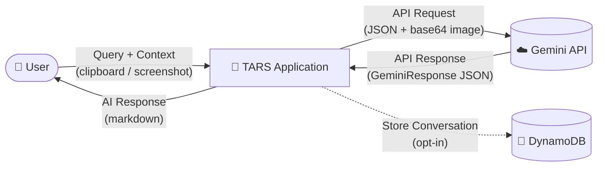
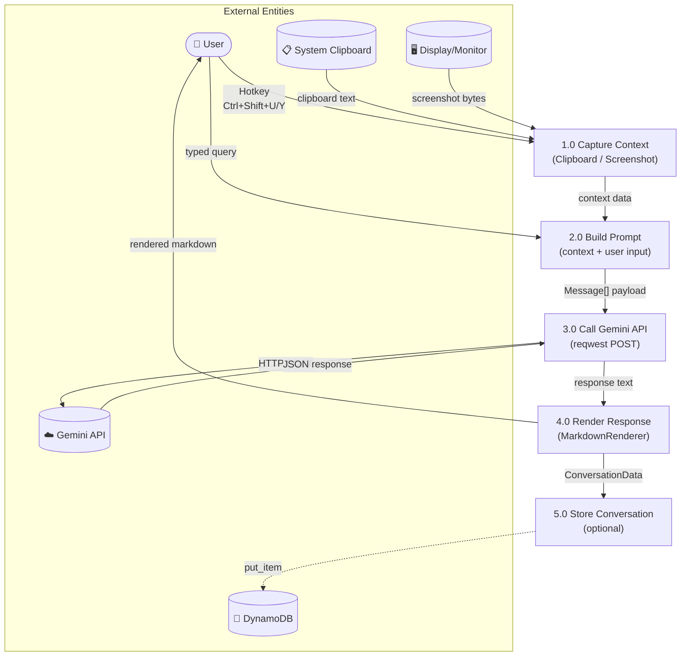
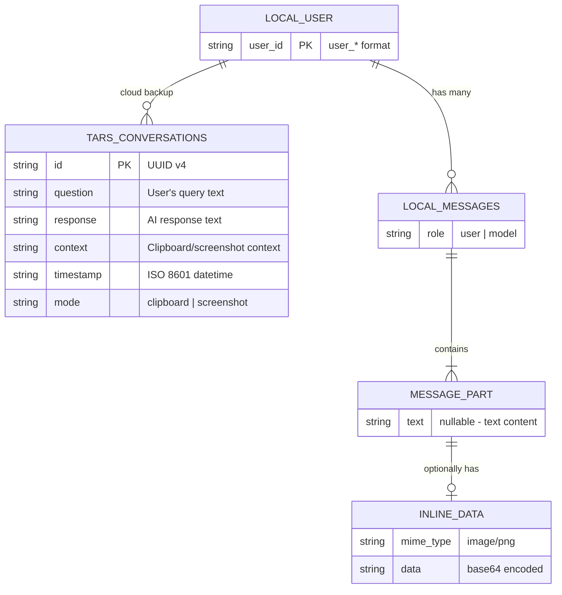
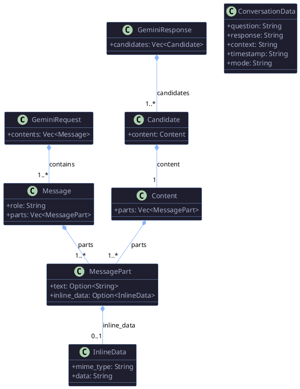
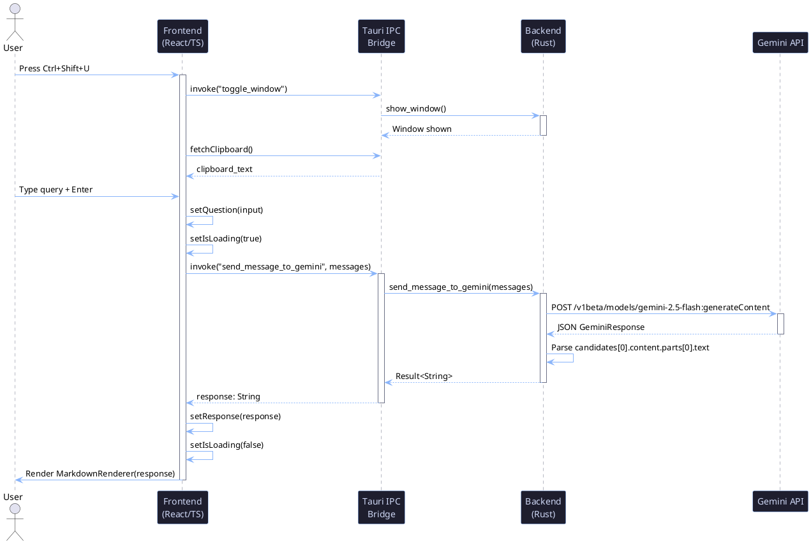
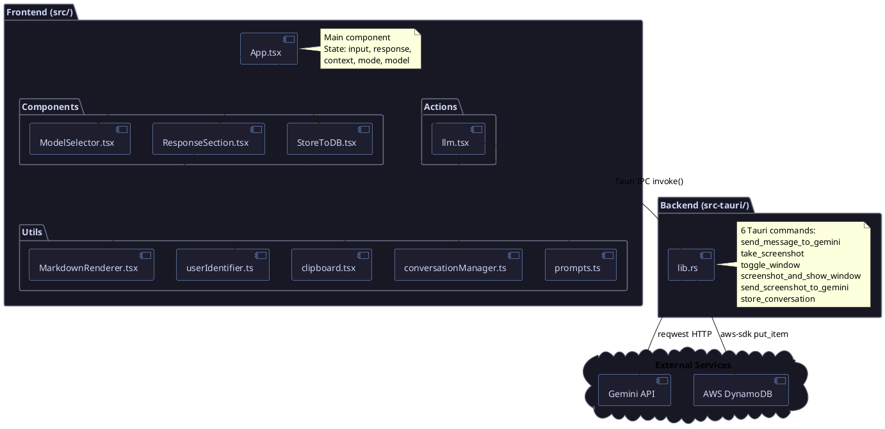
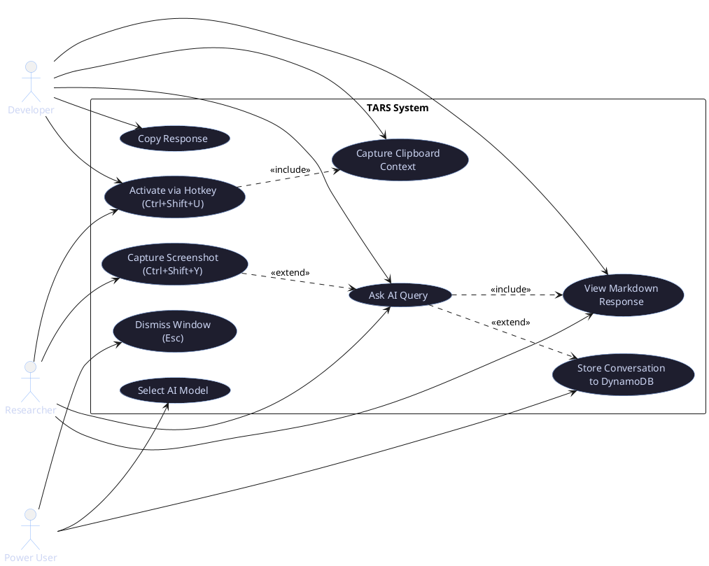

# Digital Assignment 3 — Final Project Report

**Project Name:** TARS (Text-based Autonomous Response System)  
**Student Name:** Arnav Kamra  
**GitHub:** [https://github.com/Arnav717/tars](https://github.com/Arnav717/tars)  
**Date:** 12 April 2026

---

# Part A: Testing, Version Management & Functionalities

## 1. Integration / Regression / Mutation Testing

### 1.1 Frontend Tests — Vitest (Integration + Unit)

Tests validate deterministic frontend logic across the IPC boundary using Vitest + JSDOM.

**Test file:** `src/utils/userIdentifier.test.ts`

```
$ npm test -- --reporter=verbose

 RUN  v4.1.4 /data/tars

 ✓ src/utils/userIdentifier.test.ts > userIdentifier integration and unit tests > should generate a new user id and store it in localStorage if not present  2ms
 ✓ src/utils/userIdentifier.test.ts > userIdentifier integration and unit tests > should return the existing user id from localStorage if already present  0ms

 Test Files  1 passed (1)
      Tests  2 passed (2)
   Start at  03:34:09
   Duration  1.05s (transform 37ms, setup 0ms, import 51ms, tests 4ms, environment 792ms)
```

**Test source code:**
```typescript
import { describe, it, expect, beforeEach } from 'vitest';
import { getUserId } from './userIdentifier';

describe('userIdentifier integration and unit tests', () => {
    beforeEach(() => {
        localStorage.clear();
    });

    it('should generate a new user id and store it in localStorage if not present', () => {
        const id = getUserId();
        expect(id).toBeDefined();
        expect(id).toContain('user_');
        expect(localStorage.getItem('user_id')).toBe(id);
    });

    it('should return the existing user id from localStorage if already present', () => {
        localStorage.setItem('user_id', 'existing_user_123');
        const id = getUserId();
        expect(id).toBe('existing_user_123');
    });
});
```

### 1.2 Backend Tests — Cargo Test (Unit + Regression)

Rust tests validate strict JSON serialization/deserialization of Gemini API payloads, guarding against regressions when model schemas change.

```
$ cargo test

running 2 tests
test tests::test_conversation_data_deserialization ... ok
test tests::test_message_serialization ... ok

test result: ok. 2 passed; 0 failed; 0 ignored; 0 measured; 0 filtered out; finished in 0.00s

   Doc-tests tars_lib
test result: ok. 0 passed; 0 failed; 0 ignored; 0 measured; 0 filtered out; finished in 0.00s
```

**Test source code (src-tauri/src/lib.rs):**
```rust
#[cfg(test)]
mod tests {
    use super::*;

    #[test]
    fn test_message_serialization() {
        let msg = Message {
            role: "user".to_string(),
            parts: vec![MessagePart {
                text: Some("hello world".to_string()),
                inline_data: None,
            }],
        };
        let json = serde_json::to_string(&msg).expect("Failed to serialize");
        assert_eq!(json, r#"{"role":"user","parts":[{"text":"hello world","inline_data":null}]}"#);
    }

    #[test]
    fn test_conversation_data_deserialization() {
        let json = r#"{
            "question": "What is AI?",
            "response": "AI is Artificial Intelligence.",
            "context": "Context snippet",
            "timestamp": "2026-04-12T00:00:00Z",
            "mode": "clipboard"
        }"#;
        let data: ConversationData = serde_json::from_str(json).expect("Failed to deserialize");
        assert_eq!(data.question, "What is AI?");
        assert_eq!(data.mode, "clipboard");
    }
}
```

### 1.3 Testing Strategy Summary

| Layer | Framework | Type | What Is Tested |
|-------|-----------|------|----------------|
| Frontend | Vitest + JSDOM | Integration / Unit | localStorage user ID generation, persistence, retrieval |
| Backend | Cargo test | Unit / Regression | `Message` JSON serialization, `ConversationData` deserialization against Gemini API schema |

---

## 2. Version Management and System Building

### 2.1 Git History

TARS uses **GitHub Flow** with conventional commits:

```
$ git log --oneline

7620290 (HEAD -> main) feat: add application icons, configure vitest, and implement user identifier testing
0f8a1d5 feat: v2
fcaf671 docs: add system architecture diagram and documentation
337d45c docs: add comprehensive development setup documentation
66842c6 chore: setup development environment with Docker and project structure
6573acb feat: moscow
d5ed9a6 feat: readme
249b139 Initial commit
```

### 2.2 Branching Strategy

| Branch | Purpose |
|--------|---------|
| `main` | Production-ready, always deployable |
| `feature/*` | New features (e.g., `feature/translucent-ui`) |
| `fix/*` | Bug fixes (e.g., `fix/hotkey-conflict`) |
| `docs/*` | Documentation updates |
| `test/*` | Adding tests |

### 2.3 Build System

| Component | Tool | Command |
|-----------|------|---------|
| Frontend build | Vite v6 | `npm run build` |
| Backend build | Cargo (Rust 2021) | `cargo build` |
| Full app dev | Tauri CLI | `npm run tauri:dev` |
| Production | Tauri CLI | `npm run tauri:build` |
| Docker | Docker Compose | `docker-compose up --build` |

### 2.4 Containerization

```dockerfile
# Dockerfile provides a reproducible build environment
# docker-compose.yml orchestrates the dev server on port 1420
```

---

## 3. Developed Functionalities (Screenshots)

### 3.1 Idle State — Clean Launch


The initial empty state with model selector, shortcut hints, and recording toggle visible.

### 3.2 Active Conversation — Chat Interface


User messages (right-aligned, blue tint) and AI responses (left-aligned, dark). Clipboard context shown as a dismissible card.

### 3.3 Model Selector Dropdown


Free/Premium model sections with blue checkmark for selected model. Blur backdrop for depth.

### 3.4 Loading / Thinking State


Animated blue dots with "Thinking..." text, giving a conversational typing feel.

### 3.5 Screenshot Mode (Multimodal)


Green accents indicate screenshot context is active. Status dot turns green, context card shows 📸.

### 3.6 Code Response with Syntax Highlighting


Syntax-highlighted code blocks with line numbers using Prism React Renderer (One Dark theme).

---

## 4. Tools / Technologies Used

| Component | Technology | Version |
|-----------|------------|---------|
| Desktop Framework | Tauri | v2 |
| Backend Language | Rust | 2021 edition |
| Frontend Framework | React | 18.3 |
| Language | TypeScript | ~5.6 |
| Styling | TailwindCSS | v4 |
| Build Tool | Vite | v6 |
| AI Integration | Google Gemini API | 2.5 Flash |
| Screenshot Capture | xcap | 0.0.14 |
| Cloud Storage | AWS DynamoDB | SDK v1 |
| Local Storage | localStorage | Web API |
| Containerization | Docker + Compose | Latest |
| Testing (Frontend) | Vitest + JSDOM | v4.1.4 |
| Testing (Backend) | Cargo test | Built-in |
| Version Control | Git + GitHub | Latest |
| Icons | Lucide React | Latest |
| Markdown Rendering | Prism React Renderer | Latest |

---
---

# Part C: Project Report

## 1. Problem Statement

Accessing AI assistance today involves high-friction steps: opening a browser → navigating to a chat interface → copy-pasting context → waiting → switching back to work. This creates **cognitive interruption** and breaks the user's flow state. For developers, researchers, and knowledge workers, these micro-interruptions accumulate into measurable productivity loss.

**TARS** solves this by being an always-on, translucent AI companion that leverages native desktop integration:

- Reduces time-to-answer from ~15 seconds to **< 2 seconds**
- Automatically captures **clipboard and screenshot context** — no manual copy-paste
- Stays accessible via **global keyboard shortcuts** (`Ctrl+Shift+U` / `Ctrl+Shift+Y`)
- Runs as a **lightweight native app** (~5MB) instead of a browser tab consuming 200MB+ RAM

---

## 2. User Stories

| # | As a... | I want to... | So that... |
|---|---------|-------------|------------|
| 1 | Developer | Press a global hotkey to capture my clipboard code and receive bug suggestions instantly | I don't need to leave my IDE or break my flow |
| 2 | Researcher | Take a snapshot of a graph on my screen and ask the AI to analyze visual data | I can get immediate insights without manual transcription |
| 3 | Power User | Have an unobtrusive translucent widget overlay I can query | I maintain my desktop workflow while accessing AI |
| 4 | Privacy-focused User | Have my conversations stored locally on my device | My data stays private by default |
| 5 | Developer | See syntax-highlighted code responses with copy support | I can quickly integrate AI-generated code |
| 6 | Knowledge Worker | Select text anywhere and instantly ask the AI about it | Context switching is eliminated |
| 7 | Student | Get immediate definitions and summaries while reading papers | I don't lose my place in the text |

### MoSCoW Prioritization Summary

| Priority | Count | Examples |
|----------|-------|---------|
| **Must Have** | 7 | Global hotkey, translucent UI, text capture, LLM API, Esc dismiss, launch optimization, error handling |
| **Should Have** | 6 | Conversation history, settings panel, streaming, system tray, code highlighting, markdown |
| **Could Have** | 6 | Multi-platform, keyboard shortcuts, customizable hotkey, analytics, templates, window memory |
| **Won't Have** | 5 | Offline mode, auto-startup, local LLM, search history, export |

---

## 3. System Architecture and System Design

### 3.1 Architecture Style: Layered + MVC-Inspired


### 3.2 Layer Breakdown

| Layer | Role | Technology | Key Files |
|-------|------|------------|-----------|
| **Presentation (View)** | UI rendering, user input | React 18, TailwindCSS v4 | `App.tsx`, `App.css`, `components/*` |
| **Application (Controller)** | Business logic, data transformation | TypeScript | `actions/llm.tsx`, `utils/*` |
| **IPC Bridge** | Cross-process communication | Tauri v2 IPC | `invoke()` / `#[tauri::command]` |
| **Backend (Model)** | API calls, system operations | Rust | `lib.rs` (6 commands) |
| **External Services** | Third-party APIs | Cloud/OS | Gemini API, DynamoDB, X11 |

### 3.3 Data Flow

```
User Input → App.tsx → actions/llm.tsx → invoke("send_message_to_gemini")
                                          ↓ (Tauri IPC)
                                      lib.rs → Gemini API → Response
                                          ↓ (Tauri IPC)
User ← MarkdownRenderer ← ResponseSection ← App.tsx
```

### 3.4 Design Principles

| Principle | How It's Applied |
|-----------|-----------------|
| **Abstraction** | Tauri IPC hides Rust complexity from React; `ConversationManager` abstracts storage |
| **Modularity** | Self-contained components (`ModelSelector`, `StoreToDB`, `ResponseSection`) |
| **High Cohesion** | Each file has one responsibility (e.g., `clipboard.tsx` only reads clipboard) |
| **Low Coupling** | Frontend ↔ Backend communicate only via JSON over IPC; zero shared code |

### 3.5 Key Design Decisions

| Decision | Choice | Rationale |
|----------|--------|-----------|
| Framework | Tauri v2 over Electron | Sub-200ms launch, ~5MB binary vs 80MB+, Rust memory safety |
| Auth | API keys in Rust only | Frontend never touches credentials; zero coupling with security |
| Security boundary | All API calls in Rust | Web context can't access API keys, file system, or network directly |
| Components | One file per feature | Maximum cohesion, parallel development without merge conflicts |
| Storage | localStorage + DynamoDB | Offline-first by default, opt-in cloud backup via toggle |

---

## 4. Design of Tests

### 4.1 Testing Strategy: Dual-Layered Across IPC

TARS uses a dual-layered testing approach that covers both sides of the Tauri IPC boundary:

| Layer | Framework | Environment | Purpose |
|-------|-----------|-------------|---------|
| Frontend | Vitest v4.1.4 | JSDOM | Validates deterministic UI logic, state management, localStorage integration |
| Backend | Cargo test | Native | Validates Rust data structures, JSON serialization, API payload schemas |

### 4.2 Frontend Test Design

**Test subject:** `userIdentifier.ts` — localStorage-based user identity management.

| Test Case | Type | Validates |
|-----------|------|-----------|
| Generate new ID when absent | Integration | localStorage write + read cycle, UUID format (`user_*`) |
| Return existing ID when present | Unit/Regression | Idempotent retrieval, no overwrites of existing data |

**Isolation:** `beforeEach(() => localStorage.clear())` ensures each test starts clean.

### 4.3 Backend Test Design

**Test subjects:** `Message` and `ConversationData` structs used for Gemini API communication.

| Test Case | Type | Validates |
|-----------|------|-----------|
| `test_message_serialization` | Unit | Exact JSON output of `Message` struct matches Gemini API expected format |
| `test_conversation_data_deserialization` | Regression | `ConversationData` correctly parses from JSON; guards against schema drift |

**Why these tests matter:** Any change to these structs would silently break Gemini API calls. These tests act as a contract ensuring the Rust ↔ Gemini API data format remains stable across updates.

---
---

# Appendix

## Appendix A: Software Requirements Specification (SRS)

### A.1 Functional Requirements

| ID | Requirement | Priority |
|----|-------------|----------|
| FR-01 | System shall activate via global hotkey (`Ctrl+Shift+U/Y`) | Must |
| FR-02 | System shall capture clipboard content on activation | Must |
| FR-03 | System shall capture screenshot on `Ctrl+Shift+Y` | Must |
| FR-04 | System shall send queries to Google Gemini API with context | Must |
| FR-05 | System shall render markdown responses with syntax highlighting | Should |
| FR-06 | System shall allow model selection (Gemini, Grok, Qwen) | Should |
| FR-07 | System shall persist conversations to DynamoDB (opt-in) | Should |
| FR-08 | System shall dismiss with Esc key | Must |
| FR-09 | System shall display loading animation during API calls | Must |
| FR-10 | System shall allow copying responses via `Ctrl+C` / `Ctrl+Shift+V` | Should |

### A.2 Non-Functional Requirements

| ID | Requirement | Target |
|----|-------------|--------|
| NFR-01 | Launch time | < 200ms |
| NFR-02 | Binary size | < 10MB |
| NFR-03 | Memory usage | < 50MB idle |
| NFR-04 | API response start | < 500ms |
| NFR-05 | Privacy | No telemetry by default, local-first |

---

## Appendix B: Data Flow Diagrams (DFD)

### Level 0 — Context Diagram



### Level 1 — Process Decomposition



---

## Appendix C: Entity-Relationship Diagram (ERD)

### DynamoDB + localStorage Data Model



---

## Appendix D: UML Diagrams

### D.1 Class Diagram — Backend (Rust Structs)



### D.2 Sequence Diagram — User Query Flow



### D.3 Component Diagram — Frontend



### D.4 Use Case Diagram



### D.5 Activity Diagram — Query Processing Flow

```plantuml
@startuml TARS_Activity_Diagram
skinparam monochrome false
skinparam shadowing false
skinparam activity {
    BackgroundColor #1e1e2e
    BorderColor #89b4fa
    FontColor #cdd6f4
}
skinparam diamond {
    BackgroundColor #1e1e2e
    BorderColor #f38ba8
    FontColor #cdd6f4
}

start

:User presses global hotkey;

if (Which hotkey?) then (Ctrl+Shift+U)
    :Read clipboard content;
    :Set mode = "clipboard";
else (Ctrl+Shift+Y)
    :Capture screenshot via xcap;
    :Read clipboard content;
    :Set mode = "screenshot";
endif

:Show translucent window;
:Display context card;

:User types query;
:User presses Enter;

:Set isLoading = true;
:Show "Thinking..." animation;

if (Screenshot data available?) then (yes)
    :Encode screenshot as base64 PNG;
    :invoke("send_screenshot_to_gemini");
else (no)
    :Build Message[] with context;
    :invoke("send_message_to_gemini");
endif

:Rust backend sends POST to Gemini API;
:Parse GeminiResponse JSON;

if (API success?) then (yes)
    :Extract candidates[0].content.parts[0].text;
    :Return Result<String>;
else (no)
    :Return Err(error_message);
endif

:Set isLoading = false;
:Render response via MarkdownRenderer;

if (Record toggle ON?) then (yes)
    :invoke("store_conversation");
    :Write to DynamoDB;
endif

:User reads response;

if (User action?) then (Copy)
    :Copy to clipboard via Ctrl+C;
else (Dismiss)
    :Hide window via Esc;
else (Follow-up)
    :User types new query;
endif

stop
@enduml
```

---

## Appendix E: Code Listing / GitHub Link

**GitHub Repository:** [https://github.com/Arnav717/tars](https://github.com/Arnav717/tars)

### Project Structure

```
tars/
├── src/                          # Frontend (React + TypeScript)
│   ├── App.tsx                   # Main component — state, UI layout (727 lines)
│   ├── App.css                   # TailwindCSS v4 + custom styles
│   ├── main.tsx                  # React entry point
│   ├── actions/
│   │   └── llm.tsx              # LLM communication controller
│   ├── components/
│   │   ├── ModelSelector.tsx    # AI model dropdown
│   │   ├── ResponseSection.tsx  # Response display wrapper
│   │   └── StoreToDB.tsx        # DynamoDB persistence toggle
│   ├── utils/
│   │   ├── MarkdownRenderer.tsx # Markdown + syntax highlighting
│   │   ├── clipboard.tsx        # Clipboard read utility
│   │   ├── conversationManager.ts # History CRUD
│   │   ├── prompts.ts           # System prompt templates
│   │   ├── userIdentifier.ts    # User ID generation
│   │   └── userIdentifier.test.ts # Frontend tests
│   └── lib/
│       └── utils.ts             # Tailwind cn() utility
├── src-tauri/                    # Backend (Rust + Tauri v2)
│   ├── src/
│   │   ├── main.rs              # Entry point
│   │   └── lib.rs               # 6 Tauri commands + 2 tests (319 lines)
│   ├── Cargo.toml               # Rust dependencies
│   ├── tauri.conf.json          # Tauri v2 configuration
│   └── capabilities/
│       └── default.json         # Permission grants
├── docs/                         # Documentation
│   ├── design/                  # Architecture diagram, UI screenshots, design doc
│   ├── ARCHITECTURE.md          # System architecture overview
│   └── DEV_SETUP_GUIDE.md      # Development setup instructions
├── Dockerfile                    # Docker dev environment
├── docker-compose.yml            # Docker Compose config
├── vitest.config.ts              # Vitest testing config
├── MOSCOW_PRIORITIZATION.md      # MoSCoW feature prioritization
└── README.md                     # Project documentation
```

---

*Generated: 12 April 2026*
