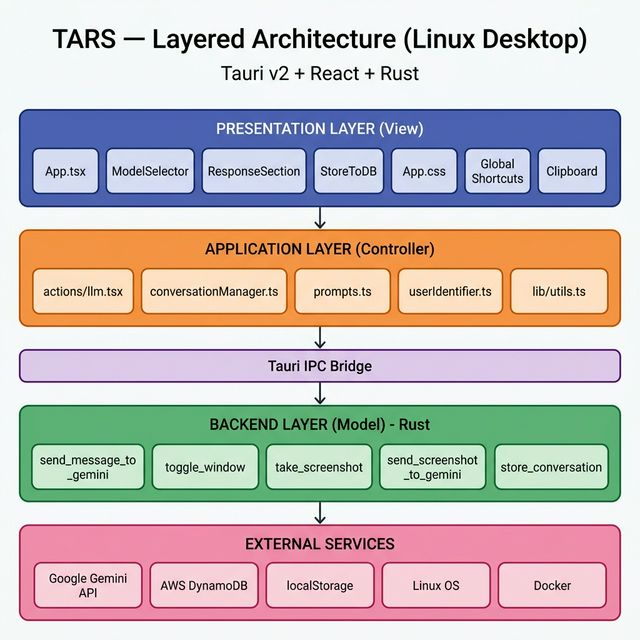
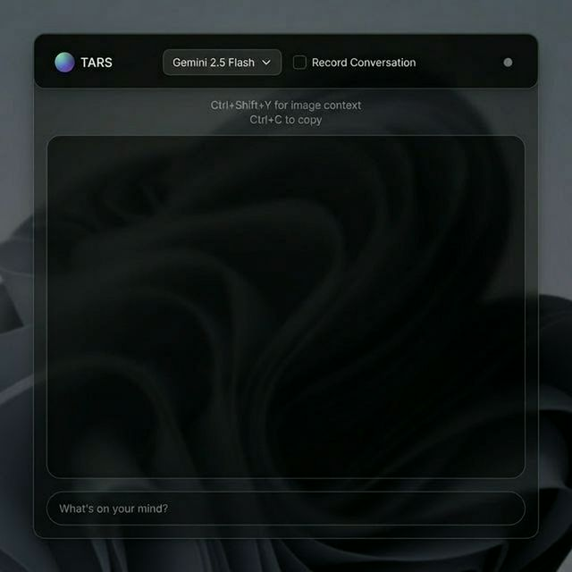
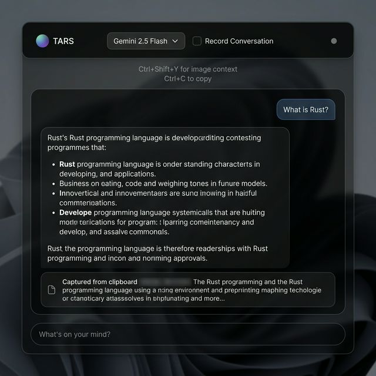
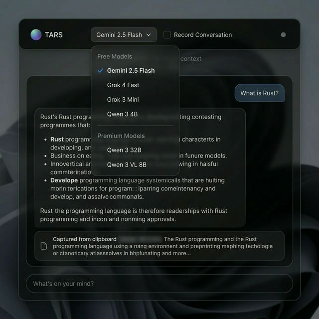
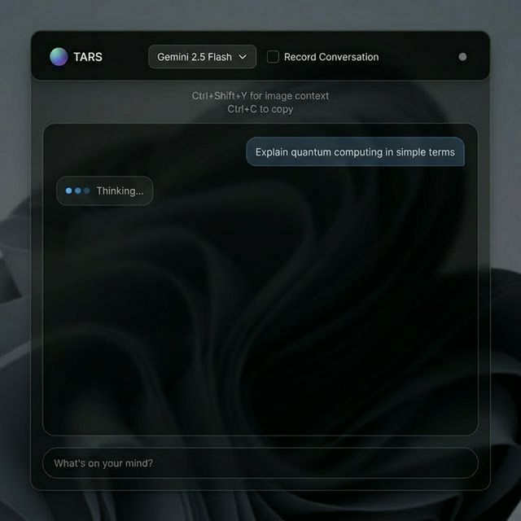
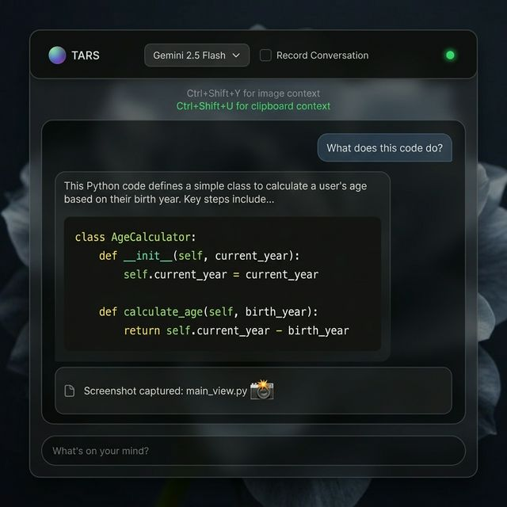
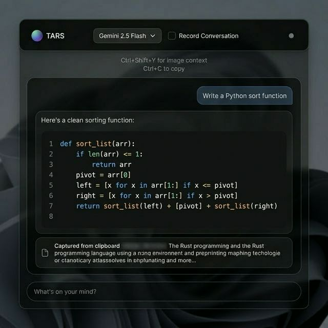

# TARS — Software Design Document

**Project:** TARS (Text-based Autonomous Response System)  
**Author:** Arnav Kamra  
**Date:** 26 March 2026  
**Version:** 2.0  
**GitHub:** https://github.com/Arnav717/tars

---

## 1. Project Overview

### 1.1 What is TARS?

**TARS (Text-based Autonomous Response System)** is a native Linux desktop AI companion built with **Tauri v2** and **Rust**. It lives quietly in your operating system as a frameless, translucent overlay — invisible when not needed, but instantly available with a single keyboard shortcut to augment your workflow with AI-powered assistance.

Unlike browser-based AI tools that require tab-switching and context loss, TARS is always one keystroke away. It captures your clipboard context automatically, analyzes screenshots, and delivers responses in a minimal, non-intrusive interface that blends into your desktop.

### 1.2 Problem Statement

Accessing AI assistance today involves high-friction steps: opening a browser → navigating to a chat interface → copy-pasting context → waiting for a response → switching back to work. This process creates **cognitive interruption** and breaks the user's flow state. For developers, researchers, and knowledge workers, these micro-interruptions accumulate into significant productivity loss.

TARS eliminates this friction by:
- Reducing the time-to-answer from ~15 seconds to **< 2 seconds**
- Automatically capturing **clipboard and screenshot context** — no manual copy-paste
- Staying always accessible via **global keyboard shortcuts** (Ctrl+Shift+U/Y)
- Running as a **lightweight native app** (~5MB) instead of a browser tab consuming 200MB+ RAM

### 1.3 Target Users

| Persona | Use Case |
|---------|----------|
| **The Developer** | Quick syntax help, error explanations, and code generation without leaving the IDE |
| **The Researcher** | Instant definitions, summaries, and fact-checking while reading papers or documentation |
| **The Knowledge Worker** | Rewriting emails/messages, brainstorming, and quick calculations during work |

### 1.4 Key Features

- **Global Hotkey Activation** — Ctrl+Shift+U (clipboard mode) / Ctrl+Shift+Y (screenshot mode)
- **Context-Aware AI** — Automatically reads clipboard content and screen captures for relevant responses
- **Multi-Model Support** — Model selector with Gemini, Grok, and Qwen options
- **Markdown Rendering** — Rich responses with syntax-highlighted code blocks, tables, and lists
- **Conversation Persistence** — Local history via localStorage + optional cloud backup via AWS DynamoDB
- **Privacy-First** — Runs locally, API keys stay in the Rust backend, recording is opt-in

---

## 2. Design Principles Applied

### 2.1 Abstraction

TARS uses **multiple layers of abstraction** to hide complexity from higher layers:

- **Tauri IPC Bridge** abstracts the Rust backend from the React frontend. The frontend calls `invoke("send_message_to_gemini", ...)` without knowing anything about HTTP clients, API keys, or error handling — all of that is encapsulated in Rust.
- **ConversationManager** class abstracts localStorage operations behind a clean API (`addMessage()`, `getHistory()`, `getGeminiFormat()`), hiding serialization and key management.
- **MarkdownRenderer** component abstracts complex markdown-to-JSX rendering with syntax highlighting behind a simple `<MarkdownRenderer content={text} />` interface.
- **Prompt templates** (`prompts.ts`) abstract the system instruction construction, allowing the AI personality to be changed in one place without touching any other file.

### 2.2 Modularity

The codebase is **organized into focused, self-contained modules**:

| Module | Responsibility | Files |
|--------|---------------|-------|
| **Presentation** | UI rendering, user interaction | `App.tsx`, `App.css`, component files |
| **Components** | Reusable UI building blocks | `ModelSelector.tsx`, `ResponseSection.tsx`, `StoreToDB.tsx` |
| **Actions** | Business logic orchestration | `actions/llm.tsx` |
| **Utilities** | Shared helper functions | `clipboard.tsx`, `conversationManager.ts`, `prompts.ts`, `userIdentifier.ts` |
| **Backend Commands** | System-level operations | `lib.rs` (6 Tauri commands) |

Each module can be modified, tested, or replaced independently. For example, swapping from Gemini to OpenAI only requires changes to `lib.rs` and `prompts.ts` — zero changes to UI components.

### 2.3 High Cohesion

Each module handles a **single, well-defined responsibility**:

- `ModelSelector.tsx` — *Only* manages AI model selection UI and state
- `StoreToDB.tsx` — *Only* manages conversation persistence toggle
- `conversationManager.ts` — *Only* manages conversation history CRUD
- `clipboard.tsx` — *Only* reads clipboard content
- Each Rust command in `lib.rs` — *One command, one function*: `send_message_to_gemini` handles API calls, `take_screenshot` handles screen capture, etc.

This high cohesion means each file has a clear purpose that can be understood at a glance.

### 2.4 Low Coupling

Components are **loosely connected** through well-defined interfaces:

- **Props-based communication:** `ModelSelector` receives an `onModelChange` callback — it doesn't know or care what happens when the model changes. `StoreToDB` receives `conversationData` as a prop — it doesn't query the chat state itself.
- **IPC decoupling:** The frontend and backend communicate *only* through Tauri's `invoke()` API. The React app doesn't import any Rust code, and Rust doesn't know about React components. They share only JSON-serializable data structures.
- **Utility independence:** `userIdentifier.ts` has zero imports from the project — it's a pure utility. `prompts.ts` takes a plain string parameter, not a complex object.
- **Separated auth logic:** The `GOOGLE_API_KEY` is managed entirely in Rust via `env::var()`. The frontend never touches API credentials, keeping the auth concern isolated in the backend layer.

---

## 3. High-Level Architecture

### 3.1 Architecture Style: Layered + MVC-Inspired

TARS follows a **Layered Architecture** with an **MVC-inspired** separation of concerns:



### 3.2 Layer Breakdown

| Layer | Role | Technology | Files |
|-------|------|------------|-------|
| **Presentation (View)** | UI rendering, user input, visual feedback | React 18, TailwindCSS v4 | `App.tsx`, `App.css`, `components/*` |
| **Application (Controller)** | Business logic, data transformation, routing | TypeScript | `actions/llm.tsx`, `utils/*` |
| **IPC Bridge** | Cross-process communication boundary | Tauri v2 IPC | `invoke()` / `#[tauri::command]` |
| **Backend (Model)** | Data access, external API calls, system operations | Rust | `lib.rs` (6 commands) |
| **External Services** | Third-party APIs and system resources | Cloud/OS | Gemini API, DynamoDB, X11, Docker |

### 3.3 Why Layered + MVC?

1. **Clear separation of concerns:** Each layer has a distinct responsibility — the UI never makes API calls directly, the backend never renders HTML.
2. **Security boundary:** The IPC bridge creates a natural security barrier. API keys and system operations stay in Rust, isolated from the web context.
3. **Testability:** Each layer can be tested independently — UI with component tests, business logic with unit tests, backend with Rust tests.
4. **Framework flexibility:** The React frontend could be swapped for Vue or Svelte without touching the Rust backend. The Gemini API could be swapped for OpenAI without touching the frontend.

### 3.4 Data Flow

```
User Input → App.tsx → actions/llm.tsx → invoke("send_message_to_gemini")
                                           ↓ (Tauri IPC)
                                       lib.rs → Gemini API → Response
                                           ↓ (Tauri IPC)
User ← MarkdownRenderer ← ResponseSection ← App.tsx
```

---

## 4. User Interface Design

### 4.1 UI Screens

TARS uses a **single-window, multi-state** design. The same frameless, translucent window adapts to different contexts:

#### Screen 1: Idle State


The initial empty state with a clean, inviting input field. Users see the model selector, shortcut hints, and recording toggle immediately. The large empty chat area signals readiness.

#### Screen 2: Active Conversation


User messages appear right-aligned (blue tint), AI responses left-aligned (dark background). Clipboard context is shown as a dismissible card with a file icon. The layout follows the natural chat pattern users expect.

#### Screen 3: Model Selector


A dropdown with Free/Premium sections. Selected model shows a blue checkmark. The dropdown uses a blur backdrop for depth while staying readable.

#### Screen 4: Loading State


Three animated blue dots with "Thinking..." text. Placed left-aligned like an incoming message, giving the feel of a conversational partner typing.

#### Screen 5: Screenshot Mode


Green accents indicate screenshot context is active. The status dot turns green, shortcut hint updates, and the context card shows a 📸 emoji. Users clearly see they're in image-analysis mode.

#### Screen 6: Code Response


Syntax-highlighted code blocks with line numbers in a dark (#1d1d1d) container. Uses Prism React Renderer with One Dark theme for professional code display.

### 4.2 UI Design Principles

| Principle | Implementation |
|-----------|---------------|
| **Consistency** | All interactive elements use the same rounded corners (16-18px), same transition duration (200ms), same color palette |
| **Clear Feedback** | Loading dots, green/gray mode indicator, "Thinking..." text, copy confirmation |
| **Keyboard-First** | Global shortcuts (Ctrl+Shift+U/Y/V), Esc to dismiss, Enter to send — designed for power users |
| **Non-Intrusive** | Frameless, transparent window with always-on-top — blends with desktop, doesn't steal focus when hidden |
| **Responsive** | Scrollable chat with auto-scroll, message max-width at 80%, context truncation at 150 chars |

---

## 5. Design Decisions & Why

### Decision 1: Tauri v2 Instead of Electron
**Choice:** Used Tauri v2 (Rust) instead of Electron (Node.js).  
**Why:** TARS needs sub-200ms launch time and low memory footprint for an "always-on" utility. Tauri's Rust backend compiles to a ~5MB binary vs Electron's ~80MB+ bundle. Rust also provides memory safety guarantees without a garbage collector.

### Decision 2: Separated Auth Logic in Rust Backend
**Choice:** API keys (`GOOGLE_API_KEY`) are managed exclusively in Rust via `env::var()`, never exposed to the frontend.  
**Why:** This keeps low coupling between the frontend and security concerns. The frontend doesn't need to know about API authentication — it just calls `invoke()` and gets results. If we switch from environment variables to OS keychain storage, zero frontend changes needed.

### Decision 3: IPC Bridge as Security Boundary
**Choice:** All external API calls (Gemini, DynamoDB) happen only in Rust, never in JavaScript.  
**Why:** The Tauri IPC bridge creates a natural trust boundary. The web context (potentially vulnerable to XSS) cannot directly access API keys, file system, or network. This follows the principle of least privilege and keeps coupling between layers minimal.

### Decision 4: Component-Per-Feature Pattern
**Choice:** Each UI feature gets its own component file (`ModelSelector.tsx`, `StoreToDB.tsx`, `ResponseSection.tsx`).  
**Why:** This maximizes cohesion — each file has one responsibility and one reason to change. Adding a new model only changes `ModelSelector.tsx`. Adding a new storage backend only changes `StoreToDB.tsx`. This also enables parallel development by team members without merge conflicts.

### Decision 5: localStorage + DynamoDB Dual Storage
**Choice:** Conversations are stored in both localStorage (immediate) and DynamoDB (optional cloud backup).  
**Why:** localStorage ensures the app works offline and responds instantly. DynamoDB is opt-in (via the "Record Conversation" toggle) for users who want cloud persistence. This separation respects user privacy (default: local-only) while enabling cloud features. The `ConversationManager` class abstracts this dual storage behind a single interface.

---

## 6. Project Structure

```
tars/
├── src/                          # Frontend (Presentation + Application layers)
│   ├── App.tsx                   # Main component — state management, UI layout
│   ├── App.css                   # TailwindCSS v4 + custom styles
│   ├── main.tsx                  # React entry point
│   ├── actions/
│   │   └── llm.tsx              # LLM communication (Controller)
│   ├── components/
│   │   ├── ModelSelector.tsx    # AI model dropdown
│   │   ├── ResponseSection.tsx  # Response display wrapper
│   │   └── StoreToDB.tsx        # Persistence toggle
│   ├── utils/
│   │   ├── MarkdownRenderer.tsx # Markdown + code rendering
│   │   ├── clipboard.tsx        # Clipboard read
│   │   ├── conversationManager.ts # History manager
│   │   ├── prompts.ts           # System prompts
│   │   └── userIdentifier.ts    # User ID
│   └── lib/
│       └── utils.ts             # Tailwind utility (cn)
├── src-tauri/                    # Backend (Model layer)
│   ├── src/
│   │   ├── main.rs              # Entry point
│   │   └── lib.rs               # All Tauri commands
│   ├── Cargo.toml               # Rust dependencies
│   ├── tauri.conf.json          # Tauri v2 config
│   └── capabilities/
│       └── default.json         # Permission grants
├── docs/                         # Documentation
│   ├── design/                  # DA2 design artifacts ← YOU ARE HERE
│   ├── ARCHITECTURE.md
│   └── DEV_SETUP_GUIDE.md
├── tests/                        # Test files
├── Dockerfile                    # Docker dev environment
├── docker-compose.yml            # Docker Compose config
└── README.md
```

---

## 7. Technology Stack

| Component | Technology | Version |
|-----------|-----------|---------|
| **Desktop Framework** | Tauri | v2 |
| **Backend** | Rust | 2021 edition |
| **Frontend Framework** | React | 18.3 |
| **TypeScript** | TypeScript | ~5.6 |
| **Styling** | TailwindCSS | v4 |
| **Build Tool** | Vite | v6 |
| **AI Integration** | Google Gemini API | 2.5 Flash |
| **Screenshot** | xcap (Linux) | 0.0.14 |
| **Storage (Cloud)** | AWS DynamoDB | SDK v1 |
| **Storage (Local)** | localStorage | Web API |
| **Containerization** | Docker + Compose | Latest |

---

*GitHub Repository: https://github.com/Arnav717/tars*
